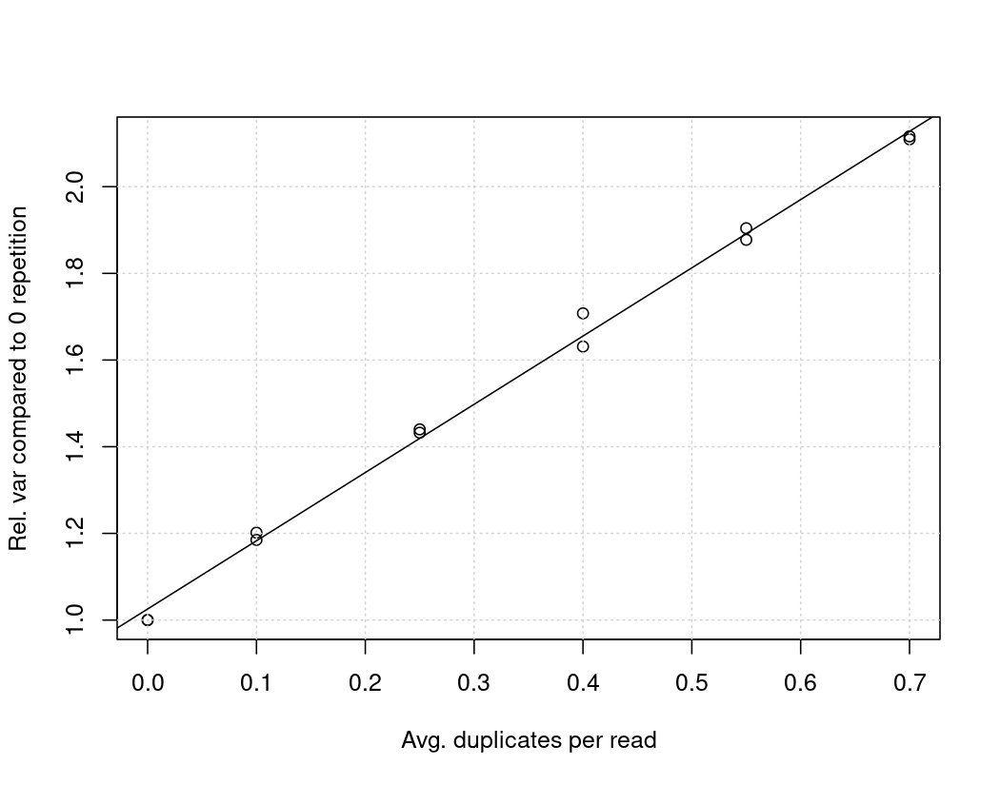

# excess-variance
Excess variance in k-mer spectra

## PCR duplication


```
Coefficients:
            Estimate Std. Error t value Pr(>|t|)    
(Intercept)  1.02560    0.01237   82.92 1.59e-15 ***
rep          1.57438    0.02992   52.61 1.49e-13 ***
```
